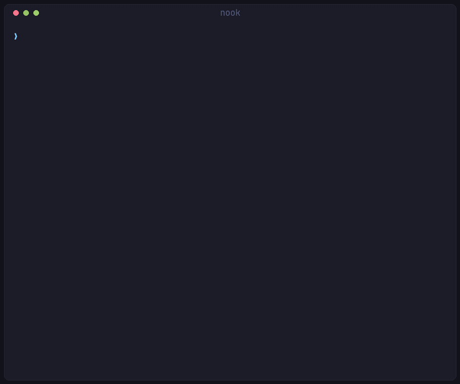

# nook

Boxes you reach from anywhere — a Raspberry Pi, a mini PC, that ThinkCentre in
the cupboard — each offering its disk to your machines two ways: as a folder
many of them can share, and as a drive that mounts like a USB stick, over the
network, with no cable.

Bash, `ssh`, `rsync` and the kernel's own block-device client. No daemon, no
database, no agent running on your laptop.

A bar widget and menu rows for [Omarchy](https://omarchy.org) live in a separate
repository, [omarchy-nook](https://github.com/achevalier-dev/omarchy-nook), and
are entirely optional — everything here works from a terminal.



*Recorded against a real Raspberry Pi — every number on screen came off the
box. Tailnet addresses and the recorder's home directory are the only things
edited, and only into placeholders. `demo/record.sh --real` captures it,
`demo/render.py` draws it, and plain `demo/record.sh` does the same against
`demo/fake-nook` for anyone without a box to point at.*

## How it fits together

Two machines, two different pieces of software. **The box** is the Pi or mini PC
in the cupboard. **Your machine** is the laptop you actually sit at.

```
   your machine                                    the box — a "nook"
   ────────────                                    ──────────────────
   nook mount   ──── SFTP ──────────────────▶      /mnt/nook/files
                                                   shared, many machines at once

   nook attach  ──── iSCSI or NBD ──────────▶      /mnt/nook/disk.img
                                                   a real drive, one machine at a time

   nook up      ──── docker over ssh ───────▶      containers

                  all of it over Tailscale
```

There are two install one-liners and they are easy to mix up, so:

| Run it on | Script | What it does |
|---|---|---|
| **the box** | `pi/boot.sh` | turns that box *into* a nook — Tailscale, storage, Docker, the drive export |
| **your machine** | `bootstrap.sh` | installs the `nook` command you drive it with |

Both, in that order. If you run `bootstrap.sh` on a Raspberry Pi it tells you so.

## Install

Two commands, one on each machine.

```bash
# on the box
curl -fsSL https://raw.githubusercontent.com/achevalier-dev/nook/main/pi/boot.sh | bash

# on your machine
curl -fsSL https://raw.githubusercontent.com/achevalier-dev/nook/main/bootstrap.sh | bash
```

The first turns the box into a nook and asks you to click a Tailscale link. The
second installs the `nook` command, signs this machine in to the same tailnet if
it is not already, then finds the box and adopts it — no hostname to type, no
account to look up, no host key to accept by hand.

The rest of this section is what those two do, for when one of them needs
steering.

### 1. On the box

Raspberry Pi OS Lite, Debian, Ubuntu — anything apt-based, x86 or ARM. An
external USB disk is worth plugging in first if you have one, but nothing here
needs it.

```bash
curl -fsSL https://raw.githubusercontent.com/achevalier-dev/nook/main/pi/boot.sh | bash
```

It prints a link and a QR code. Open it on a device already signed in to
Tailscale, and the pairing is done — no key to generate, copy or paste back.
`--ssh` goes up with it, so from then on SSH authenticates by tailnet identity
and no SSH keys are created or authorised anywhere either.

Two flags worth knowing on the first run:

```bash
… | bash -s -- --name pi --format
```

- `--name` is the box's identity. It becomes the hostname, the Tailscale name,
  and what every `nook` command calls it. Give each box its own.
- `--format` makes a filesystem on a blank external disk. **Without it nothing
  is erased** — a disk nook does not recognise is left alone and skipped, which
  is the right default when that disk might hold somebody's photos. Irrelevant
  if you are not adding a disk.

Re-running the whole thing later is the upgrade path; every step checks its own
work first.

> On a box you are driving through **Raspberry Pi Connect**, boot.sh moves
> itself into a background systemd unit — the services it restarts include the
> one carrying your session. Follow it with `journalctl -fu nook-boot`;
> Tailscale's login link appears there rather than in your terminal.

### 2. On your machine

```bash
curl -fsSL https://raw.githubusercontent.com/achevalier-dev/nook/main/bootstrap.sh | bash
```

Installs `ssh`, `jq`, `rsync`, `sshfs`, `udisks2` and Tailscale if they are
missing, clones nook to `~/.local/share/nook`, links `nook` onto your `PATH`,
and installs the Claude Code skill.

Your machine has to be on the **same tailnet as the box** — that is the whole
network. Installing Tailscale is not the same as being signed in to it, so if
the bootstrap says you are not on one yet:

```bash
sudo tailscale up
```

Same account as the box. `nook adopt` tells you which end is at fault if this
gets missed.

### 3. Pair them

The bootstrap does this for you. By hand, or for a second box:

```bash
nook adopt                 # finds it on the tailnet
nook adopt thinkcentre     # or name it
nook adopt admin@pi        # or name the account too
```

With no argument it walks the online machines on your tailnet, finds the ones
that have run the boot script, and takes the single one it finds. It tries your
own username first and then the accounts the common images ship with, and it
trusts a Tailscale peer's SSH host key on first contact — the tailnet has
already authenticated that machine by WireGuard key, which is a stronger check
than reading a fingerprint off a screen.

`adopt` reads the box's `/etc/nook.conf`, writes an SSH block with a persistent
control socket, points a Docker context at it, enables the mount unit, and adds
`~/nook` to the file manager sidebar. Run it again any time the box changes.

Then:

```bash
nook status     # is it up, how is it doing
nook mount      # its files at ~/nook/pi
nook attach     # its drive, as a real disk
nook doctor     # when something is off, this says what
```

If the box already had SSH before any of this, steps 1 and 3 collapse into one
command from your machine:

```bash
nook boot pi.local -- --name pi --format
```

## More than one box

A Pi and a mini PC are two nooks, not two installations. Run the boot script on
each with its own `--name`, adopt each, and pick which one commands talk to:

```bash
nook adopt thinkcentre
nook list                # every nook here, default marked *
nook use thinkcentre
NOOK=pi nook status      # one command elsewhere, default unchanged
nook status --all        # or all of them
nook doctor --all
```

Nothing is shared between them: the folder mounts at `~/nook/<name>`, the drive
carries the name as its label, the Docker context is `nook-<name>`, and NBD
devices are allocated per nook. Two boxes that collide on any of those look
exactly like the wrong machine answering, so `test/nooks_test.sh` keeps them
apart.

`nook forget <name>` drops one from this machine and touches nothing on the box.

## Two lanes for the same disk

They are not variations on one idea — they trade different things.

**The shared folder** is `/mnt/nook/files` over SFTP, mounted at `~/nook`. Any
number of machines can hold it at once, containers on the Pi see the same
directory, and Samba can serve it to a phone. This is where bulk files live.

```bash
nook mount
nook push ~/Downloads/big.iso
```

**The drive** is a disk image exported as a block device. Your machine sees a
real `/dev/sdX`, formats it, mounts it, and ejects it. It shows up in the file
manager sidebar with an eject button, because that is what it is.

```bash
nook attach
nook format     # first time only, and it asks
nook eject
```

> **One machine at a time.** A filesystem on a block device assumes it is the
> only thing writing to it. Two machines attaching the same drive read-write
> will corrupt it — both cache metadata and neither knows about the other.
> `nook attach` asks the Pi who holds it and refuses; `nook eject` flushes
> before it disconnects. If you want simultaneous access, that is what the
> shared folder is for.

Which transport carries the drive depends on the kernel. iSCSI is the better
one — discovery, per-initiator ACLs, automatic re-login after a reboot — but
stock Raspberry Pi OS kernels are not built with an iSCSI target, so nook falls
back to NBD, which is entirely userspace on the Pi and works everywhere.
`nook status` says which you got.

> **Neither transport authenticates.** iSCSI ships with no CHAP and NBD has no
> auth at all, so nook binds both to the Tailscale address only. That is the
> security boundary, and it is why the portal is never on `0.0.0.0`.

## Obsidian

A bare git repo on the Pi, not a sync daemon:

```bash
nook vault init main
```

Then point the Obsidian **Git** plugin at it with commit-and-sync every five
minutes and pull-on-startup. The vault gets history, conflicts are git conflicts
you can actually resolve, and it works offline by construction. Mobile Obsidian
speaks the same remote.

## Services

The things people actually put on a home server, one command each:

```bash
nook services            # the catalogue, * marks what is running
nook install jellyfin
nook uninstall jellyfin  # stops it; its data stays
```

| | |
|---|---|
| `jellyfin` | films and television |
| `audiobookshelf` | audiobooks and podcasts |
| `navidrome` | music, to anything that speaks Subsonic |
| `paperless` | scans and documents, searchable |
| `vaultwarden` | Bitwarden-compatible password vault |
| `home-assistant` | home automation |
| `uptime-kuma` | watches whether your things are up |
| `dockge` | a web UI for the stacks on the box |
| `n8n` | wires services together |
| `actual` | envelope budgeting |

Two conventions hold it together. Data lives in `/mnt/nook/apps/<name>`, so a
box is backed up by copying one directory. A library lives in the **shared
folder** — `nook push ~/Films/thing.mkv media/` and Jellyfin has it, drop a PDF
in `documents/inbox` and Paperless files it.

Every port binds the box's tailnet address, never `0.0.0.0`. Tailscale already
encrypts and authenticates everything reaching it, and a home server that
quietly listens on café wifi is how people get hurt. `home-assistant` is the one
exception, and says so: it needs host networking to discover things on your LAN.

Anything not in the list is still just compose — `nook up ~/stacks/whatever`.

### One address, and real certificates

Remembering that Jellyfin is 8096 and Navidrome is 4533 is the part that makes a
home server annoying. So the first `nook install` also puts up an index page
listing everything running, and:

```bash
nook serve
```

hands the whole lot to `tailscale serve`, which terminates TLS with a
certificate the tailnet issues for your box:

```
  https://nook.tailnet.ts.net        →  home
  https://nook.tailnet.ts.net:8096   →  jellyfin
  https://nook.tailnet.ts.net:3001   →  uptime-kuma
```

Nothing bought, nothing renewed, nothing opened on a router, and it works from a
phone on mobile data. `nook serve --off` puts it back.

That domain is not memorable, and it does not have to be:

```bash
nook open            # the index page
nook open jellyfin   # straight to it
```

Bookmark the index once and the rest are links on it. And the ugly half of that
name is changeable: `taild2db3f.ts.net` is a default Tailscale hands out, and
the admin console renames it under **DNS → Tailnet name**. Rename it once and
every address above becomes `nook.something-you-chose.ts.net`. `nook serve` says
so when it spots a default one.

It proxies to the ports the services already publish rather than moving them
behind it, so turning serve off does not take anything down. If the tailnet has
no HTTPS certificates yet, `nook serve` says exactly where to turn them on
(admin console → DNS → HTTPS Certificates) rather than half-working.

## Containers

Compose files stay on your machine; the containers run on the Pi. No editing
YAML in nano over SSH.

```bash
nook up ~/stacks/media
nook logs
nook ps
```

Build for the Pi on your laptop's much faster CPU:

```bash
docker buildx build --platform linux/arm64 --push -t ghcr.io/you/thing .
```

`pi/stack/compose.yaml` is a worked example. Nothing in it binds to `0.0.0.0`;
ports go to loopback and `tailscale serve` publishes them on the tailnet with a
real certificate.

## Commands

```
nook adopt [host] [--as name]   pair with a box that has run the boot script
nook boot <host>       run the boot script over SSH, then adopt it
nook list              every nook adopted here, default marked *
nook update            pull a newer nook and re-link it
nook use <name>        which one the other commands talk to
nook forget <name>     drop one from this machine only
nook status [--json] [--all]    temperature, disk, containers, the drive
nook doctor [--all]    check every moving part and name the broken one

nook mount / umount    the shared folder at ~/nook
nook push / pull       rsync in and out of it
nook code [path]       open the nook in VS Code over SSH

nook attach / eject    the drive
nook format            erase the drive and make a filesystem — asks first
nook grow              after a resize, fill the new space
nook disk [--local]    what the drive is doing

nook services          the catalogue, and what is running
nook install <name>    deploy one; nook uninstall <name> stops it
nook serve             https names on your tailnet, with a real certificate
nook open [service]    open it, so there is no address to remember
nook upgrade           newer images; --box, --auto, --no-auto
nook speedtest         measure the box's link; --last, --auto, --no-auto
nook up / down / ps / logs
nook vault init [name] a bare git repo for an Obsidian vault
nook ssh
nook help --all        every command
```

## Measuring the link

There is a **run speed test** button in the footer of the index page, and the
same thing from a terminal:

```bash
nook speedtest              # measure now, about half a minute
nook speedtest --last       # what it measured last time
nook speedtest --auto       # every six hours, on the box
```

The button posts to `/api/speedtest`, which `nook serve` mounts on the same
origin as the page — a page served over https cannot call a plain http port, and
asking Tailscale to mount it is cheaper than teaching nginx to proxy.

The measurement runs on the **box**, because what matters is what the nook can
reach — a laptop on the same wifi would be measuring its own link. Two more
dials appear on the index page once there is a reading, and not before: an empty
gauge for a measurement nobody has taken is worse than no gauge. The dial scale
latches upward through 25/50/100/250/500/1000, so a slow line and a fast one do
not have to share a face.

It uses Cloudflare's endpoints over plain `curl` rather than `speedtest-cli`:
curl is already required by everything else here, and a measurement that needs a
package installed is one that fails on a box somebody trimmed.

Automatic measurement is off by default — it is the one reading that costs real
bandwidth to take, and a box on a metered connection should not be doing it four
times a day because nobody said otherwise. `--speedtest` at boot, or
`nook speedtest --auto` later, turns it on.

`nook update` pulls the checkout the command runs from — bootstrap puts it in
`~/.local/share/nook` — and re-links it, so a fix does not mean remembering
where that is. It does that daily on its own; `nook update --no-auto` stops it.

`NOOK=<name>` picks a nook for one command. `NOOK_HOME` moves the whole config
directory, which is how a throwaway experiment stays out of the real one.

On the box, `nook-target` manages the export and `nook-info` prints the JSON
`nook status` reads.

## The boot script, in full

[Install](#1-on-the-box) covers the two flags that matter on a first run. The
rest, for when you need them — and re-running the script is the upgrade path,
since every step checks its own work first.

```
--name NAME       hostname, Tailscale name, and the nook's identity (default: nook)
--data PATH       where the external disk is mounted (default: /mnt/nook)
--disk-size SIZE  largest the network drive may be (default: 256G, capped to fit)
--format          make a filesystem on a blank external disk
--shares          also run Samba, for phones and non-Linux machines
--usb-gadget      also offer the drive over a USB-C cable
--skip MODULE     skip a module by name, repeatable
--detach          run in the background, surviving a dropped connection
--no-detach       stay in the foreground even on a fragile session
```

`--disk-size` is a ceiling, not a demand. The drive is a preallocated image, so
it is sized to what is actually free: at most 80% of an external disk, or 50% of
the system disk with 10GB held back for the OS, logs and container images. Below
about 4GB of usable space it is skipped, and the box is still a perfectly good
nook without one.

Nothing is formatted without `--format`: an unpartitioned USB disk is far more
likely to hold somebody's photos than to be blank. The external disk goes into
`/etc/fstab` by UUID with `nofail`, because a headless box that drops to
emergency mode over an unplugged drive is a box you have to go find a monitor
for.

`--usb-gadget` offers the same image over the USB-C port for when there is no
network at all. It exports **read-only** on purpose: the host caches the
filesystem and assumes exclusive ownership, so the image can only ever be live
on one side.

## Keeping it current

Three separate things go out of date, and conflating them is how one gets
forgotten:

```bash
nook update            # the nook command on this machine
nook upgrade           # newer images for its services, restarting what changed
nook upgrade --box     # re-run the box's boot script — it is idempotent
```

Both ends keep themselves current, because the machine nobody thinks about is
the one that ends up months behind:

```bash
nook update --auto     # daily, on this machine — on after install.sh
nook update --no-auto  # …or not
nook upgrade --auto    # weekly, on the box — on after the boot script
```

A stale command here does not look like an old version; it looks like features
that stopped working, because a menu row for a command this copy does not have
simply hides itself. So `nook update` runs from a user timer, daily with two
hours of jitter and `Persistent=true` for a laptop that was shut at the hour.
It says nothing on the days nothing moved and sends one notification when it
did, and `nook doctor` names the version and how far behind it is.

It only ever fast-forwards. A checkout with local work is refused and left
alone — `install.sh` will not even schedule the timer over one — so a working
copy is never rewritten by a timer.

`nook upgrade` restarts only what actually changed, because restarting a service
that did not is downtime for nothing. It also says when the client itself is
behind, rather than pulling out from under the command you are running.

The box does it on its own once a week — `nook upgrade --auto` / `--no-auto`,
Sunday at 04:00 with an hour of jitter, and `Persistent=true` so a box that was
switched off catches up. The OS is separate: `unattended-upgrades` handles its
security updates and nothing here touches it.

Every service's compose file lives on the **box**, at `/mnt/nook/stacks/<name>`,
not on your laptop. That is what makes any of this possible without you: the box
can restart, upgrade and be inspected on its own, and `dockge` edits the same
files.

## When something is off

`nook doctor` checks every moving part — the tailnet peer, SSH, which transport
the box uses, whether the client for it is installed here, and whether the drive
is attached. `nook doctor --all` does it for every box. Start there.

The three things that bite on a first run:

- **`dpkg was interrupted`** — a package install on that box was cut short
  before nook ever ran. boot.sh finishes it itself now; if it cannot, run
  `sudo dpkg --configure -a` and start again.
- **`ls ~/nook/<name>` hangs** — a stale sshfs mount after a suspend.
  `nook umount && nook mount`.
- **`another machine has the drive attached`** — that is the guard working, not
  a bug. The drive is a block device and only one machine may hold it. Eject it
  there, or use the shared folder, which has no such limit.

The Claude Code skill's [troubleshooting guide](skills/nook/troubleshooting.md)
goes symptom by symptom.

## Claude Code

`install.sh` links `skills/nook` into `~/.claude/skills/`. Claude then knows the
two lanes, the single-writer rule, which transport your Pi ended up with, and
what `nook doctor` is telling you — and reaches for the CLI rather than raw
`iscsiadm` and `nbd-client`.

```
skills/nook/
├── SKILL.md            the model, the safety rules, where everything lives
├── setup.md            boot script, modules, adopting
├── drive.md            transports, attach/eject/format, resizing, recovery
├── containers.md       the Docker context, compose, publishing ports
├── vaults.md           Obsidian as bare git repos
└── troubleshooting.md  symptom to cause
```

`/nook` is a slash command that runs `status` and `doctor` and reads the result.

## Structure

```
bin/nook           dispatcher
lib/common.sh      which nook a command talks to, and everything derived from it
lib/<topic>.sh     one file per area, exporting cmd_<name> functions
pi/boot.sh         the one-liner, and pi/modules/ the steps it sources
pi/bin/            helpers installed onto the Pi
skills/nook/       the Claude Code skill
systemd/ udev/     the mount unit and the rule that makes the drive removable
```

```bash
./script/check     # syntax, shellcheck, json, five behaviour tests — no box needed
./demo/record.sh && ./demo/render.py   # rebuild the recording above
```

`demo/fake-nook` is worth knowing about beyond the GIF: it runs the real
subcommands with only the Pi-facing calls replaced, which makes it the fastest
way to see what a change prints without a nook in front of you.

See [AGENTS.md](AGENTS.md) for the shell rules, and
[CONTRIBUTING.md](CONTRIBUTING.md) before a pull request.

## Requirements

**The box** — Raspberry Pi OS Lite or any Debian, and a Tailscale account. An
external USB disk is optional: without one the shared folder and the drive both
live on the system disk, sized to leave it room. An x86 mini PC works the same
way and will usually get the better transport, because its kernel has an iSCSI
target and the Pi's does not.

**Your machine** — Linux with `ssh`, `sshfs`, `jq`, `rsync` and `udisks2`, plus
`open-iscsi` or `nbd` depending on which transport the Pi ended up with.
`nook doctor` names the missing one.

## License

MIT
